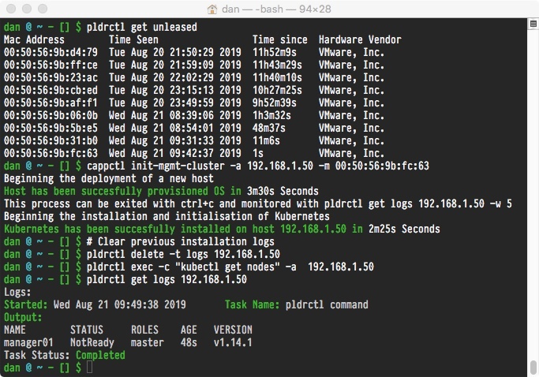

# cluster-api-provider-plunder

**WIP**

At this time only the initial `cappctl` tooling exists and this can be used to handle the initial deployment of the first Kubernetes node.

## Getting the cluster-api provider

Geting the cluster api provider:

`go get github.com/plunder-app/cluster-api-provider-plunder` 

Building the initial boot strap tooling:

`make cappctl`

This will install the `cappctl` tool in the `./bin` directory. 

## Usage

The `plunder` client configuration will be needed in the current working directory, in order for the tooling to successfully communicate.

### Find a server

`pldrctl get unleased` will return a list of servers that are currently unprovisioned

### Bootstrap first node

Pass the Mac address and an IP address to the `cappctl` tool to bootstrap the first Kubernetes node.

`cappctl init-mgmt-cluster -a 192.168.1.2 -m 00:11:22:33:44:55`

